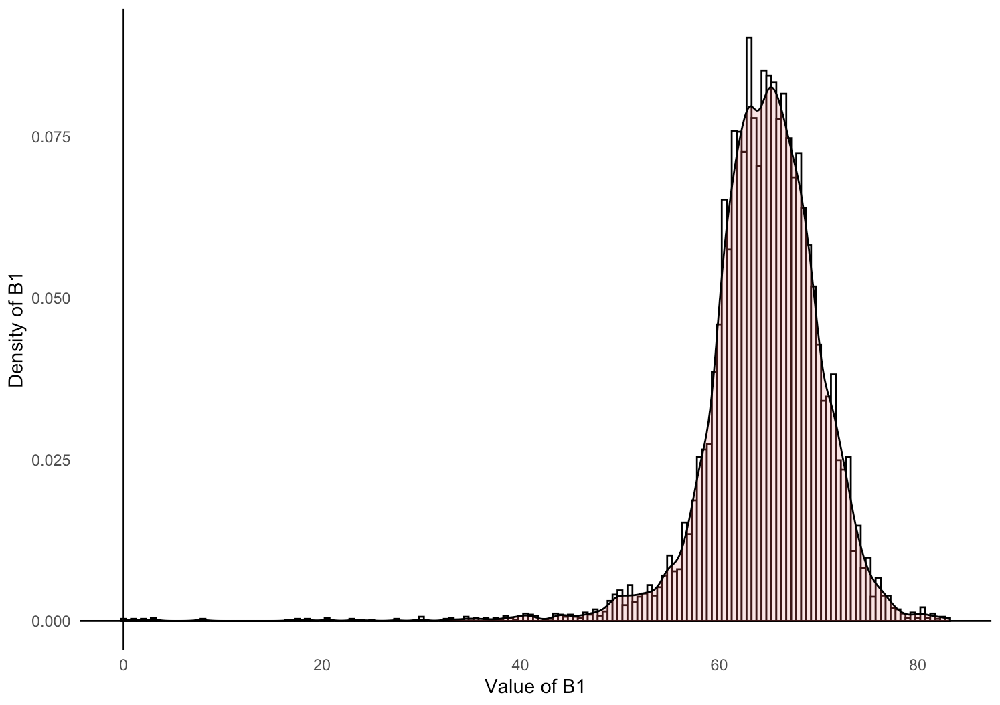

# carbcontpred: Predicting and Mapping Soil Organic Carbon Content Based on The Spectral Reflectance of Soil Samples in Hudson Bay Lowlands, Ontario, Canada

This package contains objects that are sourced from a 2022 McMaster Remote Sensing Laboratory research project and objects created to facilitate the use and analysis of the fieldwork data. The project recorded a wide range of biochemical, biophysical, and spectral metrics of 432 soil samples that were collected from the Hudson Bay Lowlands (N 51.220318, W 80.556189) and measured and analyzed at McMaster University and the University of Guelph. A portion of the project’s data has been cleaned and packaged for easy use in an ````R```` environment.

The soil samples were collected near the Kashechewan (N 52.253621, W 81.776621), Moose Factory (N 51.220318, W 80.556189), and Attawapiskat (N 52.934019, W 82.377133) First Nation communities in northern Ontario, Canada. The image below shows the 3 locations where the soil samples were collected from:

{width="90%"}

**Figure 1.** *A satellite image map of the portion of the Hudson Bay Lowlands where the soil samples were collected from. The legend displays the locations of the soil sample sites.*

The project was funded by the Natural Sciences and Engineering Research Council of Canada (NSERC) through the Discovery Grants program (RGPIN-2020-05,708). The corresponding author is Kangyu So^[McMaster University, sok11@mcmaster.ca]. The full list of authors can be found here^[Authors: Kangyu So (McMaster University, sok11@mcmaster.ca), Cheryl A. Rogers (McMaster University, rogerc11@mcmaster.ca), Alemu Gonsamo (McMaster University, gonsamoa@mcmaster.ca), Yiyao Li (McMaster University, liy571@mcmaster.ca), James Snider (World Wildlife Fund Canada, jsnider@wwfcanada.org), Clare Wark (World Wildlife Fund Canada, cwark@wwfcanada.org)].

# What Is This Package?

The package ````carbcontpred```` contains objects that are sourced from a 2022 McMaster Remote Sensing Laboratory research project and objects created to facilitate the use and analysis of the fieldwork data. This package includes data on the spectral reflectance and organic carbon content of soil samples after they have been dried in an oven for 48 hours. The package also includes the function ````cpred```` for building a linear regression model to make organic carbon content predictions, and an ````R```` Markdown file on pre-processing the data for ````cpred````. The package also includes the function ````mappred```` for using the predictions from the linear regression model to predict the organic carbon content of a Region of Interest (ROI) spectral reflectance data table and an ````R```` Markdown file on pre-processing the data for ````mappred````.

The raw data from the research project will eventually be freely available to the public through a repository on GitHub, but it is bulky and organized in a complicated manner. ````carbcontpred```` pre-processes the data in ````R````, extracting the portion of the data that is useful for developing predictive models for carbon stock in soil samples. The package also includes functions that can be used to build predictive models or be tuned in the future by the authors or an open-source community.

# Set-Up

## Installation

This is how you install the package if you have not done so yet:

```{r eval = FALSE} 
install.packages("remotes", repos = "http://cran.us.r-project.org")
library(remotes)

remotes::install_github("KangyuSo/carbcontpred", 
                         build_vignettes = TRUE)
```

Begin by loading the package:

```{r} 
library(carbcontpred)
```

## Pre-Processing Data for cpred

The 2022 McMaster Remote Sensing Laboratory research project collected soil samples from the Hudson Bay Lowlands region in northern Ontario, Canada (N 51.220318, W 80.556189). Included within are two CSV files containing data for the soil samples. The first CSV file contains data on the spectral reflectance of post-dried soil samples between the wavelengths 350 nm and 2500 nm in increments of 1 nm. 

The reflectance spectra are not normalized, so continuum removal must be applied. Which is done using the following chunk:

```{r eval = FALSE} 
ref_dry <- as.data.frame(apply(data_ref[,-1], MARGIN=2, FUN =continuumRemoval, wav = data_ref$Wavelength))
ref_dry <- cbind(Wavelength = data_ref$Wavelength, ref_dry)
```

The table is still arranged so that its definitions are composed of the wavelength and the ID of all of the soil samples, totaling 433 definitions. This is too many data definitions right now and we are only interested in the average reflectance of a given wavelength range. 

We will first calculate the average using the following chunk:

```{r eval = FALSE} 
start_row <- 350
end_row <- 2500
ref_dry <- ref_dry[start_row:end_row, 2:ncol(ref_dry)]
avg_values <- colMeans(ref_dry, na.rm = TRUE)
```

Next, we will create a new data set that records the sample ID and average reflectance in a more acceptable format:

```{r eval = FALSE} 
ref_dry_avg <- data.frame(
  "Sample_ID" = colnames(ref_dry),
  "Reflectance" = avg_values
)
```

Now, we have a data set with our sample ID and average reflectance, the latter of which will be the independent variable for the linear regression model. We need to add our dependent variable to this data set, which would be the organic carbon content. This data is stored in ````SoilMetrics_v01.csv```` in the ````\data-raw folder````.

We will merge the organic carbon content data from this data set to the data set containing the sample ID and average reflectance using the following chunk:

```{r eval = FALSE} 
ref_dry_avg <- ref_dry_avg %>%
  left_join(data_met %>% select(Sample_ID, OC), by = "Sample_ID") %>%
  rename(Organic_Carbon = OC)
```

Finally, our data is fully processed and ready to build linear regression models using the ````cpred```` function. Let's take a look at the first 6 rows of the data: 

**Table 1.** *The first 6 rows of the* ````ref_dry_avg```` *data set.*

```{r echo = FALSE} 
data(ref_dry_avg)
knitr::kable(head(ref_dry_avg))
```

See the ````process-ref_dry.Rmd```` file for complete details on how the raw data was processed for use in the ````carbcontpred```` package.

## cpred Function Overview:

The ````cpred```` function builds a linear regression model using spectral reflectance as the independent variable and organic carbon content as the dependent variable and uses it to predict the organic carbon content of soil samples based on their reflectance. The function will utilize a data set containing the spectral reflectance and organic carbon content of soil samples. In this package, that data set will be ````ref_dry_avg.rda````.

The ````cpred```` function can be applied using the following chunk:

```{r eval = FALSE} 
data <- data.frame(ref_dry_avg)
pred_c <- cpred(data, "Reflectance", "Organic_Carbon", 0.7, 10, "Predicted_Organic_Carbon")
```

For the chunk above, the parameter ````data```` represents the ````ref_dry_avg```` data set. The parameter ````"Reflectance"```` represents the ````"Reflectance"```` column of the ````ref_dry_avg```` data set which is the average reflectance between 300 nm and 2500 nm of the post-dried soil samples. The parameter ````"Organic_Carbon"```` represents the ````"Organic_Carbon"```` column of the ````ref_dry_avg```` data set which is the measured organic carbon content by percent dry weight of the post-dried soil samples. The parameters ````0.7```` and ````10```` represent the test size for the model and the number of folds for the cross-validation respectively. The parameter ````"Predicted_Organic_Carbon"```` represents the name for the predicted organic carbon content output.

The return of the function is a new column added to the previous data set which contains the predicted organic carbon content values using a cross-validated linear regression model.

Let’s take a look at the 6 rows of this newly updated data set ````pred_c```` with the predicted organic carbon content values:

**Table 2.** *The first 6 rows of the* ````pred_c```` *data set.*

```{r echo = FALSE} 
data(pred_c)
knitr::kable(head(pred_c))
```

Let's visualize this data as a scatter plot where the original and predicted organic carbon content values will be our X-axis and Y-axis respectively:

```{r eval = FALSE}
install.packages("ggplot2")
library(ggplot2)

ggplot(pred_c, aes(x = Organic_Carbon, y = Predicted_Organic_Carbon)) +
  geom_point() +
  geom_smooth(method = "lm", color = "red") +
  labs(x = "Organic_Carbon", y = "Predicted_Organic_Carbon") +
  theme_minimal() +
  theme(panel.grid = element_blank()) +
  geom_hline(yintercept = 0, linetype = "solid", color = "black") +
  geom_vline(xintercept = 0, linetype = "solid", color = "black")
```

{width="75%"}

**Figure 2.** *A scatterplot of the* ````pred_c```` *data set where the measured and predicted organic carbon content by percent dry weight of the samples are the X and Y axis respectively.*

Finally, let's evaluate our output by calculating the R^2^ value between the original and predicted organic carbon content values:

```{r eval = FALSE}
r_squared <- cor(pred_c$Organic_Carbon, pred_c$Predicted_Organic_Carbon)^2
cat("R-squared:", r_squared, "\n")
```

The R^2^ value for this example is ~0.61, which is in line with the R^2^ values from studies that used standard global soil spectral data from peatlands to predict organic carbon [@de2022peatlands].

See the ````README.Rmd```` files for additional details on how to utilize ````cpred````. See the ````cpred.R```` file for additional information about the function.

## Pre-Processing Data for mappred

The ````mappred```` function uses two data sets. The first data set is a file containing spatial information and spectral reflectance values of an ROI. The example file used in the vignette is ````Reflectance_ROI.csv```` in the ````\inst\extdata folder````. For more information on how to extract an ROI data file, see this [article](https://kangyuso.github.io/carbcontpred/articles/web_only/ROI_Files.html). The second data set consists of the sample ID, average reflectance, and measured and predicted organic carbon content of post-dried soil samples. This is normally the output from the ````cpred```` function as shown in the previous section. The example file used in the vignette is ````pred_c.rda```` in the ````\data folder````.

## mappred Function Overview:

The ````mappred```` function extracts an algebraic equation based on the reflectance and predicted organic carbon content of soil samples in a data set. The function then applies min-max normalization over the reflectance values of an ROI data set. Finally, the ````mappred```` function uses the algebraic equation to predict the organic carbon content of spatial points in the ROI data set based on their reflectance and then outputs the updated data set as a new CSV file. The function will utilize two data sets, one containing the spatial information and spectral reflectance values of an ROI and one containing the reflectance and predicted organic carbon content of soil samples. In this package, the ROI data set will be ````Reflectance_ROI.csv```` and the predicted organic carbon content data set will be ````pred_c.rda````.

The ````mappred```` function can be applied using the following chunk:

```{r eval = FALSE} 
mappred_c <- mappred(pred_c, "Reflectance", "Predicted_Organic_Carbon", system.file("extdata", "Reflectance_ROI.csv", package = "carbcontpred"), "ROI_Predicted_Carbon")
```

For the chunk above, the parameter ````pred_c```` represents the ````pred_c```` data set. The parameter ````"Reflectance"```` represents the ````"Reflectance"```` column of the ````pred_c```` data set which is the average reflectance between 300 nm and 2500 nm of the post-dried soil samples. The parameter ````"Predicted_Organic_Carbon"```` represents the ````"Predicted_Organic_Carbon"```` column of the ````pred_c```` data set which is the predicted organic carbon content by percent dry weight of the post-dried soil samples. The parameter ````system.file("extdata", "Reflectance_ROI.csv", package = "carbcontpred")```` represents the path to the ````Reflectance_ROI.csv```` file. The parameter ````"ROI_Predicted_Carbon"```` represents the name for the output of the updated data set which will contain the predicted organic carbon content of spatial points in the ````Reflectance_ROI.csv```` file.

The return of the function is a CSV file that contains the spatial information of the ROI data set but replaces the reflectance values for the points with the predicted organic carbon content. The original reflectance values and the replacement predicted organic carbon content are typically in the ````B1```` of the ROI data set. It is not recommended to run the ````mappred```` function again using this new ROI data set in place of the original ROI data set containing the reflectance values.

Let’s take a look at 6 rows of this newly created data file ````ROI_Predicted_Carbon.csv```` with the predicted organic carbon content values:

**Table 3.** *The first 6 rows of the* ````ROI_Predicted_Carbon.csv```` *data file.*

```{r echo = FALSE} 
ROI_Predicted_Carbon <- as.data.frame(read.csv(system.file("ROI_folder", "ROI_Predicted_Carbon.csv", package = "carbcontpred")))
knitr::kable(head(ROI_Predicted_Carbon))
```

Let's visualize this data as a histogram where the value and count of the ````B1```` column in the ````ROI_Predicted_Carbon.csv```` data set will be our X and Y axis respectively:

```{r eval = FALSE}
install.packages("ggplot2")
library(ggplot2)

ggplot(ROI_Predicted_Carbon, aes(x = B1)) +
    labs(x = "Value of B1", y = "Count of B1") + 
    geom_histogram(binwidth= .5, colour= "black", fill= "white") + 
    theme_minimal() +
    theme(panel.grid = element_blank()) +
    geom_hline(yintercept = 0, linetype = "solid", color = "black") +
    geom_vline(xintercept = 0, linetype = "solid", color = "black")
```

{width="75%"}

**Figure 3.** *A histogram of the* ````ROI_Predicted_Carbon.csv```` *data file where the spectral reflectance value and the count of points with that value are the X and Y axis respectively.*

We can also visualize the ````ROI_Predicted_Carbon.csv```` data set as a histogram with a kernel density curve where the value and density of the ````B1```` column in the ````ROI_Predicted_Carbon.csv```` data set will be our X and Y axis respectively:

```{r eval = FALSE}
ggplot(ROI_Predicted_Carbon, aes(x = B1)) + 
    geom_histogram(aes(y = ..density..),
                   binwidth = .5,
                   colour = "black", fill = "white") +
    labs(x = "Value of B1", y = "Density of B1") + 
    theme_minimal() +
    theme(panel.grid = element_blank()) +
    geom_hline(yintercept = 0, linetype = "solid", color = "black") +
    geom_vline(xintercept = 0, linetype = "solid", color = "black") + 
    geom_density(alpha = .2, fill = "#FF6666")
```

{width="75%"}

**Figure 4.** *A histogram of the* ````ROI_Predicted_Carbon.csv```` *data file where the spectral reflectance value and the density of points with that value are the X and Y axis respectively. A kernel density curve is overlaid on the histogram in red.*

To see how to use ````ROI_Predicted_Carbon.csv```` or another output from ````mappred```` to visualize the predicted organic carbon content of the ROI over a map, see this [article](https://kangyuso.github.io/carbcontpred/articles/web_only/ROI_Files.html).

See the ````README.Rmd```` files for additional details on how to utilize ````mappred````. See the ````mappred.R```` file for additional information about the function.

# Contributing to the carbcontpred Package

The purpose of this ````R```` package is to make the soil spectral reflectance and organic carbon content data from a 2022 McMaster University Remote Sensing Laboratory project easily available for predictive modeling and mapping in an ````R```` environment. Currently, the package only uses the reflectance and organic carbon content data of the post-dried soil samples, but we invite others from the community to request additional metrics from the original project data set, report issues such as spelling errors, and contribute to the ````carbcontpred```` package. To contribute to the package, create a branch in the repository and submit a pull request for your contribution. Contributions will be reviewed before approval and full credit will be given.

# References {#references .unnumbered}
