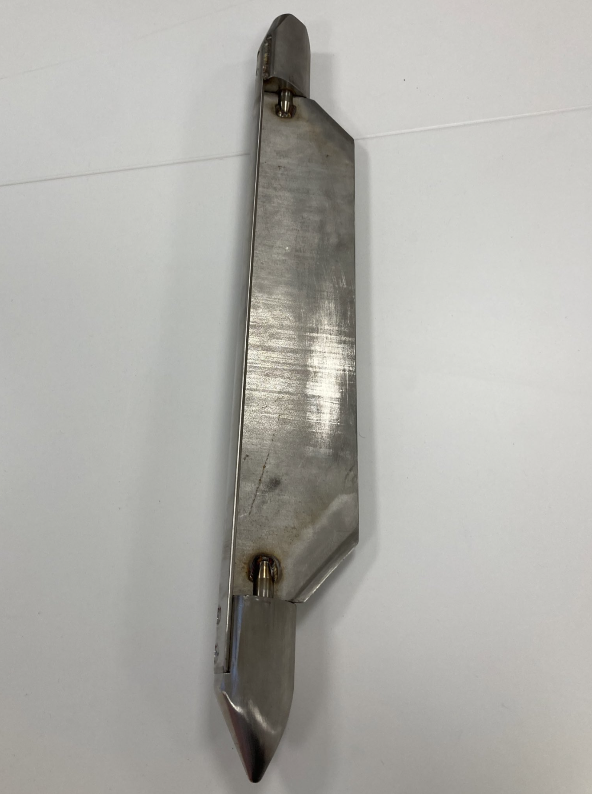
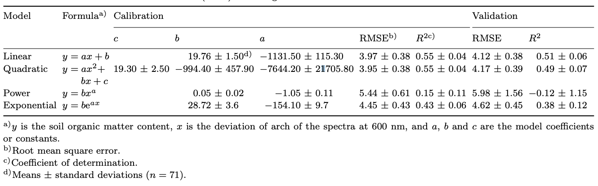

# Vis-NIR spectroscopy for predicting soil organic carbon content

Over the past couple of decades, the application of visible and near infrared (NIR) regions for soil science has been researched intensively. The visible region consists of wavelengths between 400 and 780 nm and has been used to detect soil organic matter. The NIR region consists of wavelengths between 780 and 2500 nm and has been used to detect H[2]O and CO[2]. The visible region and the near infrared (NIR) region can be combined to form the visible-near infrared (vis-NIR) region. This region has been used to predict a number of different soil properties, but organic carbon is among the most successful for accurate predictions [@stenberg2010visible].

# Effect of water on soil vis-NIR spectra

Water has a strong effect on the reflectance of soil in the vis-NIR region, especially between 1400 nm and 1900 nm. In this wavelength range, water causes the depth and width of absorption to become larger, thus decreasing reflectance as shown in **Figure 1**. This can impact the accuracy of the spectra of soil samples collected from fieldwork. Additionally, wet soil samples can have more varied particle sizes than dry samples that have been grounded, which can lead to inconsistencies in the spectra [@ji2015accounting].

{width="75%"}

**Figure 1.** *The absorbance spectra (Log 1/R) of 34 soil samples that were measured in the field (grey), in the lab (black), and after direct standardization (red) was used to remove environmental factors like water from the field spectra [@ji2015accounting].*

The ````carbcontpred```` package uses dried soil samples for the example data sets to illustrate the capability of using spectra reflectance for predicting soil organic carbon content. Dried soil samples were chosen because the output from ````cpred```` yielded a higher R^2^ value (~0.61) than the wet soil samples (~0.52).

# Measuring soil organic carbon content through dry combustion

We used a dry combustion method to measure the organic carbon content of the soil samples in the example data sets in ````carbcontpred```` through the University of Guelph’s Agriculture and Food Laboratory. This is because dry combustion is considered the standard method for chemical analysis of soil samples collected from the field. Specifically, we used an automated carbon analyzer for detecting carbon. This is done by introducing the dried soil samples to a high-temperature oxidation zone which converts carbon in the soil into CO[2]. The CO[2] gas is then carried by a carrier gas and separated from other gases through a gas chromatographic system. Finally, the CO[2] is detected using an automated infrared gas analyzer [@chatterjee2009evaluation].

**Table 1.** *A list of automated analyzers, the principles for detection, and manufacturers and their contact information [@chatterjee2009evaluation].*

```{r echo = FALSE} 
dry_combustion_table <- as.data.frame(read.csv(system.file("supplemental_information", "dry_combustion_table.csv", package = "carbcontpred")))
knitr::kable(head(dry_combustion_table))
```

A limitation of this dry combustion method using an automated is that it is incredibly expensive to use. The cost for the 432 soil samples used for the ````SoilMetrics_v01.csv```` data set was almost $10,000 CAD. Alternative methods for measuring organic carbon content include in situ methods, wet combustion, and dry combustion through the weight loss of soils through ignition [@chatterjee2009evaluation].

# Collection and processing of soil samples

We collected soil core samples using a stainless steel peat corer. **Figure 2** shows the corer used to collect the soil samples used for the ````SoilMetrics_v01.csv```` data set and **Figure 3** shows the corer being used for sample collection in the Hudson Bay Lowlands.

{width="75%"}

**Figure 2.** *The stainless steel peat corer used to collect soil core samples. It has length of ~80 cm and a width of ~10 cm wide. *

{width="75%"}

**Figure 3.** *The stainless steel peat corer being used to collect soil core samples near the Attawapiskat First Nation community in northern Ontario, Canada . *

The samples were divided into 11.56 cm^3^ segments and weighed using a Mettler Toledo Standard ME-T Precision Balance. The reflectance of the samples was measured using an ASD FieldSpec 4 Hi-Res NG spectrometer. The soil samples were then places in individual aluminum trays and air-dried in a Lab-Line Model 3511 L-C Oven as shown in **Figure 4**. The soil samples were then manually grounded using a hammer and then the mass and reflectance was measured again. Finally the soil samples were sent to the University of Guelph’s Agriculture and Food Laboratory for carbon analysis. 

{width="75%"}

**Figure 4.** *The soil samples being air-dried in a Lab-Line Model 3511 L-C Oven.*

# Linear regression modeling in cpred

There are a number of different approaches that regression models can take to predict soil properties using reflectance. One such example is by using the “deviation of arch” (DOA) parameter of the spectra which is effective for estimating soil organic matter such as organic carbon. This parameter covers the reflectance wavelength range in the range between 550 nm and 650 nm. A DOA-based regression model can come in 4 different types: linear, quadratic, power, and exponential. The best estimation of soil organic matter amongst these 4 types is linear, yielding the highest R^2^ value for the validation results at 0.51 ± 0.06 for the validation results as shown in  **Table 2**. This type of DOA-based regression model employs a linear regression model [@zheng2016estimation].

**Table 2.** *The calibration and validation performance for different types of deviation of arch (DOA)-based regression models [@zheng2016estimation].*

{width="75%"}

Although the wavelength range of the DOA parameter falls within the vis-NIR region, it misses a huge portion of the region [@zheng2016estimation]. We cannot use DOA for our prediction model in ````cpred```` because of this limitation. However, we built ````cpred```` to create a linear regression model due to its strong performance in **Table 2**.

# Min-max normalization in mappred

Min-max normalization is a technique where the data values in a data set are subtracted by the minimum value and then divided by the range which is the difference between the maximum and minimum values [@sinsomboonthong2022performance]. Min-max normalization can be demonstrated through the following equation where:

\begin{equation} \label{eq:1}X'=\frac{X - min(X)}{max(X) - min(X)}\end{equation}

*where X is a value in the data set, X' is a value in the data set after min-max normalization, min(X) is the minimum value, and max(X) is the maximum value [@sinsomboonthong2022performance].*

We built ````mappred```` to use min-max normalization on the reflectance values from the ROI data because it is one of the common methods for spectral preprocessing. Min-max normalization helps eliminate the effects of solid particle size, surface scattering, and light variation in the NIR region. This is not only limited to soil properties as min-max normalization has been used for the spectral preprocessing of other materials and surfaces. **Figure 5** shows how min-max normalization affects the distribution of the spectra in rice grains [@cheng2023rapid]. 

{width="75%"}

**Figure 5.** *The near-infrared (NIR) absorbance spectra of rice grains (A) without min-max normalization and (B) with min-max normalization [@cheng2023rapid].*

# References {#references .unnumbered}
