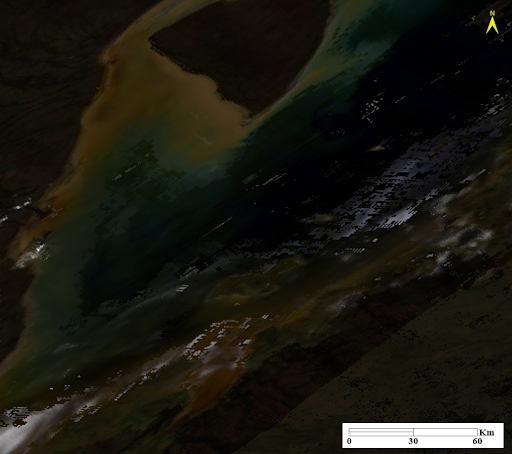
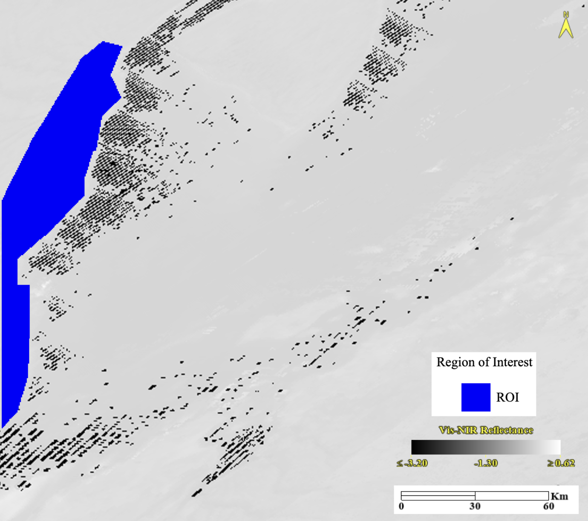
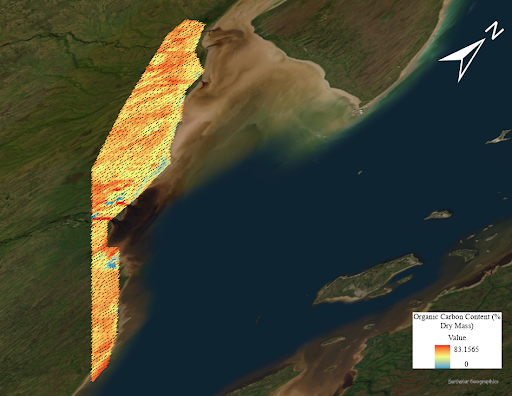

# Extracting an ROI data file for mappred

## Instructions

The ````mappred```` function uses a file containing spatial information and spectral reflectance values of a Region of Interest (ROI). An ROI is a selected sample from a raster in the image processing and analysis software ENVI [@nv5roi]. ENVI can be downloaded from the NV5 Geospatial [website](https://www.nv5geospatialsoftware.com/). A raster is a common type of data used in ENVI which is generated from a data set. Rasters are a continuous matrix or array of data numbers which can represent many different types of information. The raster that will be generated and used for the ````carbcontpred```` package will represent the spectral reflectance information [@nv5raster].

To extract an ROI data file for ````mappred```` you will first download a data set in the form of a map image and open it on ENVI. This data set will contain several spectral bands that cover specific wavelength ranges. It is important that the wavelength range of the spectral bands in the data set you use and the wavelength ranges you set during the preprocessing of data for ````mappred```` are similar. 

You will then generate a raster of spectral reflectance from this data file using the Band Math tool in ENVI which can be found in the Band Algera folder in the Toolbox. Band Math will ask for an equation prompt which you will create using the spectral bands you chose to use. In Band Math, the equation will be written as the following:

[1]\begin{equation} \label{eq:1}((B[a] + B[b] + … B[z])/n)\end{equation}

*where B[a, b, … z] are the bands you chose to use and n is the total number of chosen bands.*

Applying this equation in Band Math will generate a raster showing the average reflectance in the wavelength region that your chosen spectral bands cover. You will now create an ROI using the Region of Interest (ROI) tool at the top ribbon. You will select the New ROI option within this tool and then create a polygon out of your area of interest. Once this is done you will go to File in the tool, select Export, and then pick Export to CSV. This will output the spatial and reflectance information of points in your ROI as a data table which you will use in ````mappred````. Most of the columns in the data table consist of spatial information but the average reflectance value will be stored in the ````B1```` column.

## Example of Application

To extract ````Reflectance_ROI.csv```` which is the example ROI data file in the ````carbcontpred```` package we downloaded a data set from the Moderate Resolution Imaging Spectroradiometer (MODIS) satellite operated by the National Aeronautics and Space Administration (NASA). Specifically, we used MODIS/Terra Surface Reflectance Daily L2G Global 1km and 500m SIN Grid data set. This data set provides an estimate of surface spectral reflectance at the ground level. More information about this data set can be found [here](https://ladsweb.modaps.eosdis.nasa.gov/missions-and-measurements/products/MOD09GA) [@landmod0]. For this example, we used the data captured on October 3, 2022. We downloaded this data from the NASA Earthdata Search [website](https://search.earthdata.nasa.gov/search) under the ID MOD09GA.A2022276.h13v03.061.2022278035218. We chose this date because it is within the same year that the soil samples were collected. Although the soil samples were collected in July, we chose October because it is before snowfall and after the growing season in northern Ontario, which means that the spectral reflectance of the soil is less obstructed by snow or vegetation [@nasamod0]. We opened the downloaded file on ENVI and used Data Manager at the top ribbon to load a true colour composite of the file. Using the data set [website](https://ladsweb.modaps.eosdis.nasa.gov/missions-and-measurements/products/MOD09GA) for reference, we generated a true colour composite by putting Band 1 in the red channel, Band 4 in the green channel, and Band 3 in the blue channel [@landmod0].

{width="75%"}

**Figure 1.** *A true colour composite of the Hudson Bay Lowlands. The image is generated from ENVI using the data file MOD09GA.A2022276.h13v03.061.2022278035218 from NASA. The composite was generated by using Band 1 in the red channel, Band 4 in the green channel, and Band 3 in the blue channel.*

We generated a raster of spectral reflectance from this data file using Band Math and all 7 of the spectral bands in the file. This is because the 7 bands together cover a wavelength range from 620 nm to 2155 nm, which is a majority of the visible-near infrared (vis-NIR) region as shown on this [website](https://lpdaac.usgs.gov/products/mod09gav006/) [@landmod0]. Thus, our equation for Band Math is constructed as follows:

[2]\begin{equation} \label{eq:2}((B1 + B2 + B3 + B4 + B5 + B6 + B7)/7)\end{equation}

*where B1 to B7 are Bands 1 to 7 from the MOD09GA.A2022276.h13v03.061.2022278035218 data file.*

After generating a raster of spectral reflectance from this data file using the Band Math tool, we used the Region of Interest (ROI) tool to create an ROI that covers the area around our soil sample sites as well as nearby peatlands. 

{width="75%"}

**Figure 2.** *A raster of the Hudson Bay Lowlands showing the average reflectance value over a wavelength range of 620 nm to 2155 nm. The blue area represents the Region of Interest (ROI). The image is generated from ENVI using the data file MOD09GA.A2022276.h13v03.061.2022278035218 from NASA. The raster was generated by the average value of Bands 1 to 7 in the data file.*

Finally, we used Export to CSV to extract a data table containing the spatial and reflectance information of points in our ROI. The data table can be found in ````Reflectance_ROI.csv```` in the ````carbcontpred```` package. **Table 1** shows the first 6 rows of the ````ROI_Predicted_Carbon.csv```` data file.

**Table 1.** *The first 6 rows of the* ````ROI_Predicted_Carbon.csv```` *data file. The ````B1```` column represents the average reflectance values of the spatial points over a wavelength range of 620 nm to 2155 nm.*

```{r echo = FALSE} 
ROI_Predicted_Carbon <- as.data.frame(read.csv(system.file("ROI_folder", "ROI_Predicted_Carbon.csv", package = "carbcontpred")))
knitr::kable(head(ROI_Predicted_Carbon))
```

# Visualizing the output of mappred 

## Instructions

The ````mappred```` function will output a file similar to the ROI data file you used as the input. The difference is that the spectral reflectance values under the ````B1```` column are now replaced with the predicted organic carbon content. We can visualize the predicted organic carbon content on a map through the geographic information system software ArcGIS Pro. ArcGIS Pro can be downloaded from the Esri [website](https://www.esri.com/en-us/arcgis/products/arcgis-pro/overview).

You will open ArcGIS Pro and set a basemap to whatever you choose and then upload your output ROI data file as a standalone table in the Contents pane. You will then select the file and use the Display XY Data action to create a point feature class based on the x and y values from your file (XY Table To Point will also work). To do this, your parameters for the X Field, Y Field, and Z Field will be your Lon, Lat, and your predicted organic carbon content (Usually the ````B1```` column). The rest of the parameters can be customized according to your preferences. This will create a layer of points over your ROI based on the spatial information provided in the data file. Next, you will use Conversion Tools and select Point to Raster (Feature to Raster will also work). The prompt will ask for your Input Features and your Value field, which will be your point feature class and your predicted organic carbon content values (Usually the ````B1```` column) respectively. The rest of the parameters can be customized according to your preferences. The output of this map is a raster similar to the one for the spectral reflectance values in the previous section, except it is for the predicted organic carbon content instead of reflectance.

## Example of Application

The output using the example in the ````carbcontpred```` package is ````ROI_Predicted_Carbon.csv````. We opened ArcGIS Pro and selected the basemap to be Imagery. We uploaded ````ROI_Predicted_Carbon.csv```` as a standalone table in the Contents pane and then used the Display XY Data action to create a point feature class with Lon, Lat, and the ````B1```` column as the X Field, Y Field, and Z Field respectively while leaving the default settings for everything else. We then used Point to Raster and selected the point feature class and the ````B1```` column for the Input Features and the Value field respectively. We left the default selection for Cell assignment type, Priority field, and Cellsize, which were Most frequent, NONE, and 0.008 respectively. The output of this map is shown in **Figure 3**.

{width="75%"}

**Figure 3.** *A raster of the Hudson Bay Lowlands showing the predicted organic carbon content in percent dry mass of the Region of Interest (ROI). The image is generated using the data file MOD09GA.A2022276.h13v03.061.2022278035218 from NASA and the ````carbcontpred```` package. The cell size is 0.008.*

# References {#references .unnumbered}
