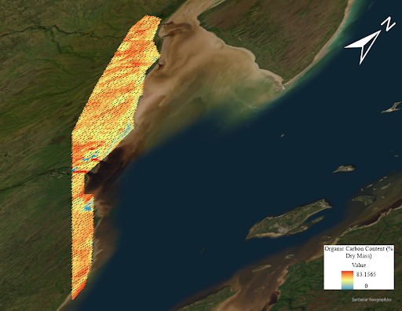

# Overview

This article discusses how the ````carbcontpred```` package can be customized to fit your specific objectives and circumstances regarding the prediction of soil properties. Customization includes the type of data used for processing as well as the functions within ````carbcontpred```` package itself. The article also discusses some limitations of the ````carbcontpred```` package.

# Using dry or wet soil samples

The ````carbcontpred```` package uses dried soil samples for the example data sets due to the high water content in the samples affecting the performance of the predictions as mentioned in this [article](https://kangyuso.github.io/carbcontpred/articles/web_only/Background_Information.html). However, soil samples from drier areas than the peatlands in the Hudson Bay Lowlands may benefit from utilizing wet soil samples instead. The water content within drier samples may be low enough that it would only have a small effect on the prediction accuracy [@ji2015accounting]. The drying process may lead to the loss of some carbon content within samples, and so dried soil samples that already had little water content beforehand may have a worse prediction accuracy than when they were wet. Thus, in some cases, using the wet soil samples for the ````carbcontpred```` package may lead to better prediction performance than if you were to use the dried soil samples. In the case of the example data sets, the soil samples were collected from peatlands which have a very high water content so the dried soil samples yielded better prediction accuracy [@price1999importance].

# Continuity between cpred and mappred inputs and outputs

We recommend that you keep the location of the soil samples for ````cpred```` and the ROI for ````mappred```` within the same area or nearby. Although models such as the linear regression model built in ````cpred```` can use either local or global data sets, the prediction performance using global data is worse than the performance for the local data. Additionally, the predictions from the linear regression model may not be helpful for predicting the organic carbon content of ROIs in different areas. The soil in a different area may contain minerals or other properties that affect the reflectance spectra, thus making predictions from one area to another very susceptible to covariables [@de2022peatlands]. We recommend at least keeping the type of soil or ground consistent between the soil samples for ````cpred```` and the ROI for ````mappred````. The example in the ````carbcontpred```` package uses an ROI that remains within ~200 km^2^ of the soil sample sites and covers mostly peatland, the same type of area as where the soil samples were collected from. 

# mappred linear equation

The ````mappred```` function utilizes a linear equation to predict the organic carbon content of an ROI data table using its reflectance values. The equation is as follows:

[1]\begin{equation} \label{eq:1}y = β*α + α*x*-β\end{equation}

*where α represents a coefficient extracted from predictions made by ````cpred````, β is a manually inputted value, x represents the reflectance values of the points from the ROI data file, and y represents the predicted organic carbon of the points.*

The values of β can be adjusted depending on the specific type of soil or soil properties you are dealing with. However, β must be adjusted so that β*α should never be above 100 or below 0 as such values are unrealistic for a percentage which is what y represents. The example for ````mappred```` adapts the equation by replacing β with 3 as follows:

[2]\begin{equation} \label{eq:2}y = 3*α + α*x*-3\end{equation}

*where α represents a coefficient extracted from predictions made by ````cpred````, x represents the reflectance values of the points from the ROI data file, and y represents the predicted organic carbon of the points.*

This equation is written in this section of ````mappred.R````:

```{r eval = FALSE}
predicted_carbon <- 3 * as.vector(coefficient) + as.vector(coefficient) * as.numeric(ROI$B1) * -3
```
Here, α is represented through ````as.vector(coefficient)````, β is represented through ````3````, x is represented through ````as.numeric(ROI$B1)````, and y is represented through ````predicted_carbon````.

# Data loss between ENVI and ArcGIS Pro

It should be noted that using the two softwares ENVI and ArcGIS Pro for extraction and visualization of an ROI data file respectively as shown in this [article](https://kangyuso.github.io/carbcontpred/articles/web_only/ROI_Files.html) can lead to some loss of data if the Cellsize is too small in the Point to Raster tool of ArcGIS Pro. For example, visualizing the ````ROI_Predicted_Carbon.csv```` data file on ArcGIS Pro using a Cellsize of 0.056 leads to some of the data missing in the raster:

{width="75%"}

**Figure 1.** *A raster of the Hudson Bay Lowlands showing the predicted organic carbon content in percent dry mass of the Region of Interest (ROI). The image is generated using the data file MOD09GA.A2022276.h13v03.061.2022278035218 from NASA and the ````carbcontpred```` package. The Cellsize is 0.056.*

# Reuse for different soil properties and areas

While  ````carbcontpred```` creates a predictive model and map for carbon stock through spectral reflectance, the package can be adapted for a variety of other uses. Different soil properties can be used as the predictor in ````cpred```` such as peat content, gravimetric water content, and bulk density. The response in ````cpred```` can be other different soil chemical properties such as nitrogen or inorganic carbon content. Additionally, ````carbcontpred```` can be customized to predict soil properties not only for other peatland regions in the world but also for other ecosystems and biomes. 

# References {#references .unnumbered}
